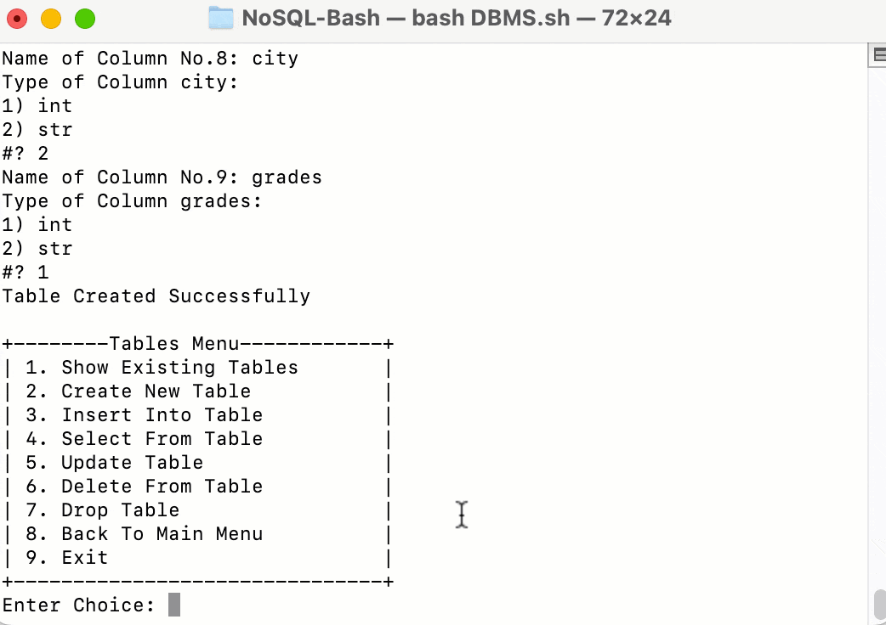

# Bash Database Management System (DBMS)

A simple database management system using Bash shell scripting it is Document Database based on files and directories.

## Features

- Select a database
- Create a database
- Rename a database
- Drop a database
- Show existing databases
- Show existing tables within a database
- Create a new table
- Insert data into a table
- Select data from a table
- Update data in a table
- Delete data from a table
- Drop a table

## Usage

1. Clone the repository or download the Bash script.
2. Run the script using the command: `bash DBMS.sh`.
   
<figure style="border: 2px solid black; padding: 5px;">
  
</figure>

## Authors

- Islam Wahid ([@IslamWahid](https://github.com/IslamWahid))
- Sherif Abdulmawla ([@Sherifabdulmawla](https://github.com/Sherifabdulmawla))
- Bashir Aljounaidy ([@BashirAljounaidy](https://github.com/BashirAljounaidy))
## License

This project is licensed under the [GNU General Public License v3.0](http://gnu.org/licenses/gpl.html). Feel free to modify and redistribute it.

Please note that there is NO WARRANTY for this software.

## Instructions

1. Run the script and follow the on-screen instructions.
2. Use the provided main menu to select the desired operation.
3. Follow the prompts to perform the desired action on databases and tables.

Enjoy using the Bash DBMS!